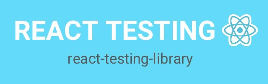

<h3>Hi, I'm Diego! 🤘🏽</h3>

 🌍 Global citizen living in Brazil!

 🏀 I Like Playing Basketball in my spare time...

 👩🏽‍💻 Software Developer:

  
  
  
   
  
  
  
   
  
  
  
  
  
  
  
  
 

    

<h4>Find me</h4>

